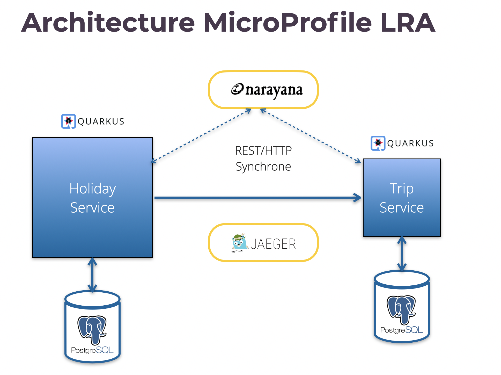

= MicroProfile LRA demo

This project demonstrates how to use https://download.eclipse.org/microprofile/microprofile-lra-1.0-M1/microprofile-lra-spec.html[MicroProfile Long Runing Actions] on a concrete use case.

It has been showcased during talks at Devoxx France, Bordeaux JUG and DevFest Lille.

It is made of 3 modules :

. **lra-coordinator**: acts as a lightweight Transaction Manager, based on Narayana
. **Holiday**: the edge service exposed to the outside. Starts the LRA and invokes specialized backend services such as trip, hotel and car. In this version, only trip is implemented. Feel free to download this example and to complete it with the 2 other services. This will be a good exercice!
. **Trip**: a backend service invoked by Holiday.

== Technical architecture

Comments:

. Both services are implemented with **Quarkus**
. They expose a REST API and use CDI and JPA internally
. https://jbossts.blogspot.com/[*Narayana*] acts as LRA Coordinator, it is packaged and run as a Quarkus project
. *Jaeger* is used to trace the traffic between the services and Naryana. This allows to understand how LRA works behind the scene
. Both services have their own database schema. For the sake of simplicity a single *PostgreSQL* server instance is used.

== Technical context

As of this date (June 2022), the following technical context has been used:

. Java 17.0.3-zulu
. Quarkus 2.9.2.Final
. GraalVM 22.1.0
. Maven 3.8.4
. docker compose

It has been developped on MacOS. Some fixes may be required on Linux or Windows. Docker images support arm64 (Mac M1) architecture. 

== Ports in use

. Jeager: 3306
. Postgres: 5432
. LRA Coordinator: 50000
. Trip : 8082
. Holiday : 8080

== How to build

Run _mvn clean package_ in the main directory. 

== How to start the demo

=== Start Jeager and PostgreSQL

Jeager et PostgreSQL are run with docker compose.

To start them:

. cd lra-infra
. ./start-infra.sh: previous containers and volumes are pruned to start with a fresh situation.

=== Start the LRA Coordinator

LRA Coordinator is a standard Quarkus project:

. cd lra-coordinator
. ./start-coordinator.sh: the ObjectStore directory, where transactions are stored, is removed before running Naryana to start with a fresh situation.

=== Start Trip

. cd trip
. ./start-trip.sh

=== Start Holiday

. cd holiday
. ./start-holiday.sh

== Understanding the demo

Before running the demo, it is important to understand the processing in place:

image::images/lra-demo-processing.png[]

Comments :

. *Holiday* acts as the edge service exposed to the outside. When receiving a HolidayBookResource, it starts the LRA and checks the customer id (accepted value: 42)
. It invokes *Trip* which checks the departure (accepted value: Paris) and the destination (accepted values: London, Dublin, Budapest, Barcelona), determines the transport (BOAT, TRAIN, PLANE) and the time schedule
. Invoking Hotel and Car is not yet implemented
. Holiday cheks the total price that shouldn't exceed 500.00

The LRA is started when receiving a HolidayBookRequest. 

It is canceled if:

* Customer id is NOK
* Departure and destination are NOK
* Total price exceeds the maximum value
* In case of timeout

It is accepted if all checks are OK with no timeout.

== How to run the demo

All the demo can be run with Holiday Swagger UI: http://localhost:8080/q/swagger-ui/

LRA trafic can be checked with Jaegger UI: http://localhost:16686/search. Choose lra-coordinator, holiday or trip services to understand what happens behind the hood.

Trip Swagger UI can also be used to check the status of Trip entities: http://localhost:8082/q/swagger-ui/

=== Demo 1: accepted book request

From Holiday Swagger UI: 

. Chose HolidayResource POST "Book a Holiday with LRA"
. Select "Let's go to London" from the examples
. Try it and execute it.

The response status should be ACCEPTED.

You can check the LRA requests sent to the coordinator with Jeager GUI:

. a LRA has been started
. 2 participants have joined it 
. it has been closed normally.

Check the consistency of the Trip entity:

. get the trip_id value of the response in Holiday Swagger UI
. go to Trip Swagger UI and select "find by id"
. the status should be ACCEPTED.

=== Demo 2: customer id NOK

From holiday Swagger UI:
. change the customer id value to 4
. execute it.

The request has been rejected by Holiday with a business error "Unknown customer".

With Jaeger GUI you can check that:

. a LRA has been started
. only one participant has joined it since Trip has bot been invoked

=== Demo 3: destination NOK

From holiday Swagger UI:

. Reset the customer id value to 42
. Change the destination to "Londonx"
. Execute it.

The request has been rejected by Trip with a business error "Rejected destination Londonx".

With Jaeger GUI you can check that:

. A LRA has been started
. 2 participants have joined it 
. It has been canceled

Check the consistency of the Trip entity:

. get the trip_id value of the response in Holiday Swagger UI
. go to Trip Swagger UI and select "find by id"
. the status should be REJECTED.

=== Demo 4: max price exceeded

From holiday Swagger UI:

. Reset the destination value to "London"
. Change the value of people_count to 2
. Execute it

The request has been rejected by Holiday with a business error "Max pricing exceeded".

With Jaeger GUI you can check that:

. A LRA has been started
. 2 participants have joined it 
. It has been canceled

Check the consistency of the Trip entity:

. Get the trip_id value of the response in Holiday Swagger UI
. Switch to Trip Swagger UI and select "find by id"
. The status should be CANCELED.

=== Demo 5: Trip timeout

From Holiday Swagger UI: 

. Select "Let's go to Dublin" from the examples
. Execute it.

This example illustrates that the compensate method can be run concurrently to the book method for the LRA in some circunstances. Here is what happens:

* Holiday is configured with a timeout of 1 sec when invoking Trip (see application.properties)
* When the destination is DUBLIN, Trip sleeps 1.5 sec before answering
* Holiday cancels the LRA after 1 sec
* The LRA is canceled while Trip is still processing the request
* When the Trip compensate method is called, it does not find any request with the given LRA id.

The code has been enforced to tackle this issue:

* If no business request with the given LRA id has been found when compensating, a database record is stored in a dedicated "compensated_lra" table
* Before returning, the book method checks whether the LRA has already been canceled by reading this table. If yes, the status switch to CANCELED.

## Demo 6: LRA timeout

From Holiday Swagger UI: 

. Select "Let's go to Budapest" from the examples
. Execute it.

This example illustrates what happens in case of LRA timeout:

* The LRA is configured with a time limit of 2 seconds on Holiday (see HolidayResource.java)
* When the destination is BUDAPEST, Holiday sleeps 3 sec at the end of the book method before answering (see HolidayService.java)
* The LRA is canceled by the lra-coordinator while Holiday is still in the book method and after Trip has accepted the booking
* When the Holiday compensate method is called, it does not find any request with the given LRA id.

The code has been enforced to tackle this issue:

* If no business request with the given LRA id has been found by Holiday when compensating, a database record is stored in a dedicated "compensated_lra" table
* Before returning, the book method checks whether the LRA has already been canceled by reading this table. If yes, the status switch to CANCELED
* Trip also set the book status to CANCELED when receiving the compensate request.

## Testing the annotations

The LRA specification is based on annotations and defines precisely how to use them. Any error is detected at deployment time.

It is possible to test the annotations before by running (on holiday or trip):
[source,]
----
mvn test
----

The test is based on _maven-plugin-lra-annotations_ provided by Narayana (declared in pom.xml).

For example, if you forget to declare a @Compensate method, you get an error message similar to this one:

[source,]
----
The class annotated with org.eclipse.microprofile.lra.annotation.ws.rs.LRA missing at least one of the annotations Compensate or AfterLRA Class: io.jefrajames.lrademo.holiday.boundary.HolidayResource
----

## Performance consideration

You can get a view of the LRA response time by executing _Find all holidays_ on Holiday Swagger UI after the demos.

There are 2 response times per request:

* *book_response_time* measures the time spent running the Holiday book method (@LRA annotated)
* *lra_response_time* measures the whole LRA duration including  confirmation or compensation.

On my Laptop, in JVM mode, the difference is around 20 msec. This can be considered as the overhead of the LRA coordination. This provides an indication. Of course this value may vary depending on the underlying infrastructure.

## Running in native mode

Holiday can be built and run in native mode:

. mvn compile -Pnative to build
. ./target/holiday-1.0-runner to run.
